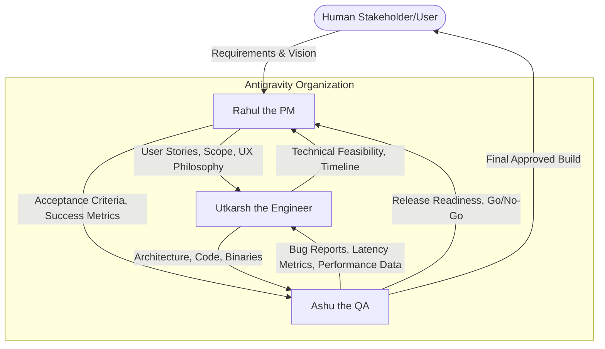

# tap-tap-boom: Agent Organization and Collaboration Structure

This document defines the multi-agent organization and collaboration structure inside Antigravity for building the **tap-tap-boom** Kotlin Compose Multiplatform application.

## 1. High-Level Agent Architecture Diagram

---

## 2. Agent Profiles & Scope

### 2.1 Rahul the PM
- **Role Definition:** The visionary and scope-keeper. Ensures the project delivers business value, meets user needs, and ships on time.
- **Goals:** Define a compelling MVP, ensure strict prioritization, and maintain the product roadmap.
- **Inputs:** Human stakeholder prompts, market research, platform constraints.
- **Outputs:** Product Requirements Document (PRD), Feature Roadmap, User Stories, UX Philosophy, Success Metrics.
- **Tools:** `knowledge_base_search` (market trends), `document_editor` (PRD writing), `task_board_manager` (Jira/Linear equivalent).
- **Review Criteria:** Are requirements unambiguous? Is the MVP scope strictly defined without feature creep? Are metrics measurable?
- **Failure Handling Process:** If a feature takes too long (Utkarsh pushback), Rahul ruthlessly cuts scope to protect the release timeline.

**Specific Deliverables:**
- **MVP Definition:** 10 interactive animations, 1 baseline synthesizer sound pack, Android & iOS targets.
- **Feature Roadmap:** V1 (Core Interactions) → V2 (Custom Sound Packs) → V3 (Desktop Support) → V4 (Web Port).
- **Success Metrics:** Session length > 3 mins, crash-free sessions > 99.9%, App Store rating > 4.5.
- **Performance Benchmarks:** Target 60fps visually, < 50ms audio trigger latency.
- **UX Philosophy:** "Zero friction." No onboarding screens. The app opens directly to a blank, interactive canvas.

### 2.2 Utkarsh the Engineer
- **Role Definition:** The technical architect and primary builder. Transforms Rahul's requirements into performant, scalable, and maintainable KMP code.
- **Goals:** Deliver smooth 60fps animations, ultra-low latency audio, and a clean, testable architecture.
- **Inputs:** PRD, User Stories, UI/UX descriptions, Bug Reports from Ashu the QA.
- **Outputs:** Commits, Architecture Documents, Pull Requests, Shared UI/Logic modules.
- **Tools:** `code_writer`, `terminal_execution` (Gradle builds), `git_manager`.
- **Review Criteria:** Code adheres to SOLID principles, build passes, zero static analysis warnings, PRs have unit tests.
- **Failure Handling Process:** If a platform-specific issue blocks unified logic (e.g., iOS audio latency issues), Utkarsh cascades the problem to Rahul for scope adjustment or allocates a spike to write platform-specific Swift/Kotlin bounds.

**Specific Deliverables:**
- **Architecture:** Clean Architecture + MVI (Model-View-Intent). Unidirectional Data Flow is critical for syncing UI state with audio triggers.
- **Module Breakdown:**
  - `:shared:domain` (Entities, Use Cases)
  - `:shared:data` (Repositories, Sound Asset Management)
  - `:shared:ui` (Compose Multiplatform Canvas, ViewModels)
  - `:androidApp` (Android-specific entry point, Oboe/AudioTrack engine implementation)
  - `:iosApp` (iOS-specific entry point, AVAudioEngine implementation)
  - `:desktopApp` (JVM entry point)
- **Audio Abstraction Layer:** `expect interface AudioEngine` in common, with `actual` implementations handling OpenSL ES / Oboe on Android and `AVAudioEngine` on iOS for latency control.
- **Animation Strategy:** Leverage Compose `Canvas` with raw drawing primitives and `Animatable` coroutines for 60fps performance without composition overhead.
- **State Management:** MVI using Kotlin StateFlow. Intents (`KeyPress`, `Touch`) generate new Immutable States (`AnimationTriggered`, `Idle`).
- **Dependency Injection:** Koin (multiplatform compatible, pure Kotlin).
- **Testing Strategy:** JUnit/MockK for domain, Compose UI Tests for visual verification.

### 2.3 Ashu the QA
- **Role Definition:** The gatekeeper of performance and correctness. Ensures the app feels instantaneous and bug-free.
- **Goals:** Validate zero functional bugs and ensure strict adherence to latency and framerate benchmarks.
- **Inputs:** PR builds (binaries), Acceptance Criteria, Use Cases.
- **Outputs:** Bug Tickets, Performance Reports, Test Coverage Reports, Go/No-Go Release Decisions.
- **Tools:** `automated_test_runner`, `profiler_analyzer`, `log_parser`.
- **Review Criteria:** Complete test coverage mapping to Rahul's user stories; reproducible bug steps.
- **Failure Handling Process:** If a build fails release criteria, Ashu blocks the release branch and bounces the ticket back to Utkarsh with exact logs and reproduction steps.

**Specific Deliverables:**
- **Test Strategy:** 
  - **Unit:** Domain logic, state reducers.
  - **Integration:** Audio buffer preloading flows.
  - **UI/Perf:** Automated Compose UI tests running with Macrobenchmark to clock frame rendering times.
- **Audio Latency Testing:** Simulated rapid multi-touch injection, logging the delta between `Intent` dispatch and `AudioEngine.play()` invocation (must be < 16ms to fit within one frame).
- **Regression Flow:** Automated suite executed via GitHub Actions on every push to `main`.
- **Release Criteria:** 0 P0/P1 bugs, 100% CI pass, < 5% dropped frames under heavy load.
- **Edge Cases Defined:** App backgrounding during sound playback, rapid 10-finger multi-touch, offline cold boot, audio volume changes mid-animation.

---

## 3. Detailed Responsibility Matrix (RACI)

| Deliverable | Rahul the PM | Utkarsh the Engineer | Ashu the QA |
| :--- | :---: | :---: | :---: |
| Product Requirements Document | R, A | C | C |
| Core Architecture Design | I | R, A | C |
| Common UI / MVI Implementation| I | R, A | I |
| Platform Audio Implementation | I | R, A | I |
| Performance Automation Tests | I | C | R, A |
| Bug Triage & Prioritization | R, A | C | C |
| Final Release Sign-off | A | I | R |

*(R = Responsible, A = Accountable, C = Consulted, I = Informed)*

---

## 4. Execution Flow from Idea → Production

1. **Ideation Phase:** Rahul generates the PRD and extracts User Stories. Creates initial Epics (e.g., "Core Audio Engine").
2. **Design Phase:** Utkarsh consumes Epics and writes the Architecture Definition Document (ADD). Ashu writes the Test Plan concurrently.
3. **Setup Phase:** Utkarsh bootstraps KMP project, configures Gradle, sets up Koin, and establishes the CI/CD pipeline.
4. **Development Loop:**
   - Utkarsh writes code in feature branches.
   - Utkarsh opens PR.
   - CI runs static analysis (Detekt, Ktlint) and unit tests.
   - Ashu runs performance benchmarks and simulated UI interactions on the PR build.
5. **Review Loop:** Ashu approves/rejects based on latency/fps metrics and functional correctness.
6. **Staging:** Code merges to `main`. Ashu performs final regression and edge-case simulation.
7. **Release:** Rahul reviews Ashu's release report, signs off, and triggers the automated deployment pipeline to App Stores.

---

## 5. Example Sprint Breakdown (2-Week Iteration)

**Sprint 1: The "Beating Heart" MVP**
- **Sprint Goal:** Achieve end-to-end sync between a single canvas touch, a visual ripple, and a synthesized sound.

| Ticket ID | Title | Assignee | Status Workflow |
| :--- | :--- | :--- | :--- |
| KMP-01 | Setup Kotlin Multiplatform App Shell & CI | Utkarsh | Backlog -> In Progress -> Code Review -> Done |
| KMP-02 | Define `AudioEngine` expect/actual interface | Utkarsh | Backlog -> In Progress -> Code Review -> Done |
| KMP-03 | Implement Android Oboe Audio Backend | Utkarsh | Backlog -> In Progress -> Code QA -> Done |
| KMP-04 | Implement basic Compose Canvas Input detection | Utkarsh | Backlog -> In Progress -> Code Review -> Done |
| KMP-05 | Write Audio Latency integration test suite | Ashu | Backlog -> In Progress -> Code Review -> Done |
| KMP-06 | Define V1 Soundpack JSON Schema | Rahul | In Progress -> Review -> Done |

---

## 6. Production Readiness Checklist

Before moving to the App Store/Play Store, the organization must clear this checklist:

- [ ] **Architecture:** Unidirectional Data Flow implemented (no rogue side-effects causing UI stutter).
- [ ] **Audio:** Sounds are pre-loaded into memory buffers during splash (no disk I/O on tap).
- [ ] **Rendering:** Compose `Canvas` avoids unnecessary recompositions; drawing reads directly from `StateFlow`.
- [ ] **Size:** ProGuard / R8 enabled for Android; Dead code stripped.
- [ ] **Crashlytics:** Multiplatform crash reporting mapped (e.g., via Napier + Firebase Crashlytics on native).
- [ ] **Analytics:** Anonymous usage tracking (session duration, most used keys) is compliant with GDPR/App Tracking Transparency.
- [ ] **Testing:** CI pipeline passes 100% of Macrobenchmark rendering tests on physical device farms.
- [ ] **Offline:** App functions flawlessly without a network connection.

---

## 7. Risk Mitigation Plan

| Risk Factor | Impact | Mitigation Strategy (Agent Response) |
| :--- | :--- | :--- |
| **High Audio Latency on Android** (Due to hardware fragmentation) | Critical | **Utkarsh:** Use Google's Oboe library (C++) wrapper via JNI instead of standard standard `MediaPlayer`. **Ashu:** Implement tight latency threshold tests specifically for bottom-tier Android devices. |
| **Animation Drop Frames** (Garbage Collection pauses) | High | **Utkarsh:** Avoid object allocation inside `onDraw` bounds. Re-use objects. **Rahul:** Accept slightly simplified particle math if 60fps is heavily at risk. |
| **Excessive App Size** (Uncompressed high-quality audio files) | Medium | **Utkarsh:** Implement dynamic feature modules or on-the-fly decryption/decompression. **Rahul:** Restrict the base app to 1 lightweight core sound pack; others are downloaded post-install. |
| **KMP iOS Interop limits** (Coroutines/StateFlow crossing boundaries) | High | **Utkarsh:** Export interfaces via SKIE to ensure Swift can natively subscribe to Kotlin StateFlows without bridging overhead. |
