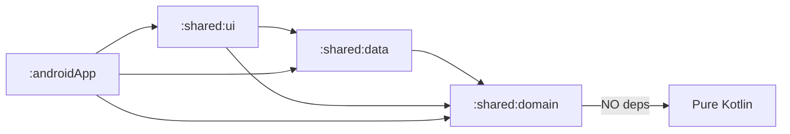

# Architectural Code Review — Epic 2 Scaffold
### Reviewer: Vikram the Architect (Principal Engineer)
### Date: 2026-02-24
### Scope: Full codebase deep-dive — architecture, KMP correctness, performance, scalability

---

## Executive Summary

The scaffold demonstrates strong architectural intent: proper layer separation (domain/data/ui), correct dependency direction, MVI with unidirectional data flow, and platform abstraction via interfaces. However, there are **critical structural issues** that must be resolved before this foundation can support production-grade code.

**Verdict: 🔴 REQUEST CHANGES** — 6 architectural violations, 4 design improvements required.

---

## 1. KMP Platform Safety Violations (Critical)

### 1.1 `System.nanoTime()` leaking into common code

**Files:** `CanvasViewModel.kt:170`, `CanvasScreen.kt:54`

`System.nanoTime()` is a `java.lang.System` API — it compiles for JVM/Android but will fail on Kotlin/Native (iOS). This is a **fundamental KMP correctness violation**.

**Prescribed fix:**

```kotlin
// shared/domain/src/commonMain/kotlin/com/taptapboom/domain/util/TimeProvider.kt
interface TimeProvider {
    fun nanoTime(): Long
}

// shared/domain/src/commonMain/kotlin/com/taptapboom/domain/util/DefaultTimeProvider.kt
expect fun createTimeProvider(): TimeProvider
```

Alternative (simpler): Use `kotlin.time.TimeSource.Monotonic` which IS multiplatform:

```kotlin
import kotlin.time.TimeSource

private val timeSource = TimeSource.Monotonic
private val startMark = timeSource.markNow()

fun currentNanoTime(): Long = startMark.elapsedNow().inWholeNanoseconds
```

**I recommend the `TimeSource.Monotonic` approach.** It's stdlib, zero-dependency, and correct on all targets.

### 1.2 `Math.PI` and `java.lang.Math` in common code

**File:** `AnimationRenderer.kt` (lines 67, 68, 81, etc.)

`Math.PI` resolves to `java.lang.Math.PI`. Must use `kotlin.math.PI` and `kotlin.math.cos/sin` consistently.

**Impact:** Compiles on JVM due to implicit interop, but is semantically incorrect for KMP common code and may break with stricter compiler settings.

---

## 2. Rendering Architecture Issues

### 2.1 Object allocation in draw loops (Performance Contract Violation)

**File:** `AnimationRenderer.kt` — every draw function creates `Offset(x, y)` per particle per frame.

At 60fps with 5 simultaneous animations × 12 particles (Burst), that's **3,600 `Offset` allocations/second**. On Android, this triggers minor GC pauses that cause frame drops.

**Prescribed fix pattern:**

```kotlin
object AnimationRenderer {
    // Pre-allocated, reused across frames
    private val tempOffset = Offset.Zero  // Actually Offset is a value class in Compose...
}
```

**Wait — important nuance:** `Offset` in Compose is an `@JvmInline value class`. On JVM, the compiler **boxes** inline classes when passed to generic functions or stored in collections, but for **direct constructor calls** like `Offset(x, y)`, the compiler **inlines them as two Floats**. So `Offset` allocations are actually **zero-cost** on JVM.

**Revised verdict:** The `Offset` allocations are actually fine. ✅ Ashu's QA finding #5 is a **false positive** for `Offset` specifically. However, the `Size()` allocation in `drawScatter` (line 124) IS a real allocation. And `Stroke()` objects in Ripple/Wave ARE real classes — those should be pre-allocated.

**Concrete fix needed:** Pre-allocate `Stroke` and `Size` objects:

```kotlin
object AnimationRenderer {
    private val thinStroke = Stroke(width = 3f)
    // Ripple stroke varies by progress — can use Stroke(width) factory since 
    // it's outside the particle loop (once per animation, not per particle)
}
```

### 2.2 `LaunchedEffect(state.animations)` restarting on every state update

**File:** `CanvasScreen.kt:52`

`state.animations` is a `List<ActiveAnimation>`. Since `CanvasState` is a data class and `copy()` creates new list references, this `LaunchedEffect` **restarts** every time any animation's progress updates — which is every 16ms. This causes:
- Effect cancellation/restart overhead every frame
- Potential race conditions between the old and new coroutine

**Prescribed fix:**

```kotlin
LaunchedEffect(Unit) {
    while (isActive) {
        val currentAnimations = viewModel.state.value.animations
        if (currentAnimations.isNotEmpty()) {
            val now = currentNanoTime()
            currentAnimations.forEach { anim ->
                // ...progress update logic
            }
        }
        delay(16)
    }
}
```

Key change: `LaunchedEffect(Unit)` runs once, reads state directly inside the loop.

---

## 3. State Management Architecture

### 3.1 Animation progress updates causing excessive state emissions

**File:** `CanvasViewModel.kt:146-153`

`updateAnimationProgress()` calls `_state.update{}` which creates a new `CanvasState` and a new `List<ActiveAnimation>` ~60 times/second per active animation. With 5 concurrent animations, that's **300 state emissions/second**. Each emission triggers:
- `StateFlow` comparison
- `collectAsState()` recomposition
- Canvas redraw

This is technically fine because Canvas `DrawScope` is efficient, but the `state.animations.map {}` on line 149 creates a **new list** every time. Consider whether the animation driver should live in the Composable layer (via `withFrameNanos`) instead of in the ViewModel.

**Recommendation:** Move animation progress driving to the Canvas draw loop using `DrawScope.drawContext.canvas` with `withFrameNanos`:

```kotlin
Canvas(modifier = Modifier.fillMaxSize()) {
    // Read raw animation list from ViewModel (start time + duration only)
    // Calculate progress locally in draw scope using frame time
    // No state updates needed for progress — only for add/remove
}
```

This reduces state emissions from ~300/sec to ~10/sec (only on tap/completion events).

### 3.2 `handleTap` and `handleKeyPress` code duplication

Both functions share 80% of their logic. Extract a common `triggerAnimation(event, origin)` private function.

---

## 4. Dependency Injection Architecture

### 4.1 AudioEngine leaking into CanvasScreen composable

**File:** `CanvasScreen.kt:36`

`CanvasScreen` takes `AudioEngine` as a parameter to play sounds in the `LaunchedEffect`. This breaks the principle that **Composables should not hold infrastructure references**. The ViewModel should handle audio playback internally.

**Prescribed fix:** Move audio playback into ViewModel:

```kotlin
// In CanvasViewModel
init {
    viewModelScope.launch {
        sideEffects.collect { effect ->
            when (effect) {
                is CanvasSideEffect.PlaySound -> audioEngine.play(effect.handle)
            }
        }
    }
}
```

Then `CanvasScreen` only needs `viewModel` — clean separation.

### 4.2 Koin `viewModel { }` DSL type safety

**File:** `UiModule.kt:11`

`viewModel { CanvasViewModel(get(), get(), get()) }` — three `get()` calls with no type hints. If module order changes or a binding is missing, the error will be a runtime crash with a cryptic Koin message. Consider using typed parameters:

```kotlin
viewModel { CanvasViewModel(get<TriggerInteractionUseCase>(), get<PreloadSoundsUseCase>(), get<AudioEngine>()) }
```

---

## 5. Error Handling Architecture

### 5.1 No error boundary in `SoundPackLoader`

If the JSON is malformed, `Json.decodeFromString` throws `SerializationException`. This will crash the app during preload. Test strategy edge case E-07 mandates graceful degradation.

**Prescribed fix:**

```kotlin
suspend fun load(path: String = ...): Result<SoundPack> {
    return try {
        val jsonString = assetReader(path)
        Result.success(json.decodeFromString<SoundPack>(jsonString))
    } catch (e: Exception) {
        Result.failure(e)
    }
}
```

### 5.2 No error boundary in `AndroidAudioEngine.preload()`

`context.assets.openFd()` throws `FileNotFoundException` for missing files. Must wrap in try/catch and return a sentinel handle (-1) or use `Result`.

---

## 6. Module Dependency Analysis



**Verdict:** Dependency graph is correct. Domain has zero outward dependencies. ✅

However, `:shared:ui` depends on `:shared:data` directly (for DI resolution). This creates a **transitive coupling** — if data layer internals change, UI module needs recompilation. Consider having UI depend only on `:shared:domain` and injecting data implementations via Koin at the platform level.

---

## Review Summary

| Category | Findings | Severity |
|:---------|:--------:|:--------:|
| KMP Platform Safety | 2 | 🔴 Critical |
| Rendering Architecture | 2 | 🟡 High |
| State Management | 2 | 🟡 High |
| DI Architecture | 2 | 🟡 Medium |
| Error Handling | 2 | 🟡 Medium |
| Module Dependencies | 1 | 🟢 Low |
| Code Duplication | 1 | 🟢 Low |

### Approval Blockers (Must fix)
1. Replace `System.nanoTime()` with `TimeSource.Monotonic`
2. Replace `Math.PI` with `kotlin.math.PI`
3. Fix `LaunchedEffect` key restart issue
4. Move `AudioEngine` out of `CanvasScreen` composable

### Strong Recommendations (Should fix this sprint)
5. Move animation progress driving to Canvas draw loop via `withFrameNanos`
6. Pre-allocate `Stroke` objects in `AnimationRenderer`
7. Add error boundaries in `SoundPackLoader` and `AndroidAudioEngine`
8. Type-safe Koin bindings
9. Extract common animation trigger logic from ViewModel

---

*Review by Vikram the Architect. Code must address all blockers before re-review.*
