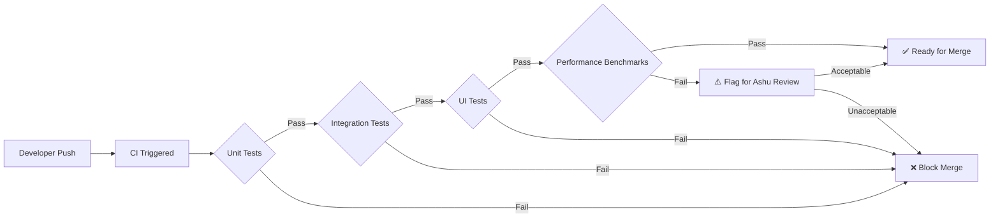

# Quality & Test Strategy
### tap-tap-boom — Comprehensive QA Plan
**Author:** Ashu the QA
**Date:** 2026-02-24
**Version:** 1.0

---

## 1. Test Philosophy

> **"If it can't be measured, it can't be shipped."**

tap-tap-boom's core value proposition is **instantaneous, synchronized audio-visual feedback**. A single frame of perceptible lag destroys the experience. Therefore, this test strategy treats **latency and frame rate as first-class functional requirements**, not afterthoughts.

---

## 2. Test Pyramid

```
            ┌──────────┐
            │  Manual   │  ← Exploratory, feel-based testing
            │  (5%)     │
           ┌┴──────────┴┐
           │  UI Tests   │  ← Compose UI tests, screenshot tests
           │  (15%)      │
          ┌┴────────────┴┐
          │  Integration  │  ← Audio pipeline, state flow, Koin wiring
          │  (30%)        │
         ┌┴──────────────┴┐
         │   Unit Tests    │  ← Domain logic, use cases, reducers
         │   (50%)         │
         └────────────────┘
```

**Target Code Coverage:** ≥ 80% line coverage on `:shared:domain` and `:shared:data`. UI layer measured by scenario coverage, not line coverage.

---

## 3. Test Categories

### 3.1 Unit Tests

| Module | What's Tested | Framework | Run Frequency |
| :--- | :--- | :--- | :--- |
| `:shared:domain` | `TriggerInteractionUseCase` — correct sound/animation mapping for each key | kotlin.test + MockK | Every commit (CI) |
| `:shared:domain` | `PreloadSoundsUseCase` — calls `AudioEngine.preload()` for all pack sounds | kotlin.test + MockK | Every commit (CI) |
| `:shared:data` | `SoundPackLoader` — parses valid JSON, rejects malformed JSON | kotlin.test | Every commit (CI) |
| `:shared:data` | `AudioBufferCache` — eviction policy, max size enforcement | kotlin.test | Every commit (CI) |
| `:shared:ui` | `CanvasViewModel` — state reducer: Tap → animations list grows, AnimationCompleted → shrinks | kotlin.test + Turbine | Every commit (CI) |
| `:shared:ui` | `CanvasViewModel` — side effect: Tap → emits `PlaySound` side effect | kotlin.test + Turbine | Every commit (CI) |
| `:shared:ui` | Background hue shift — wraps at 360° | kotlin.test | Every commit (CI) |

### 3.2 Integration Tests

| Scenario | What's Validated | Framework |
| :--- | :--- | :--- |
| **Full Tap Pipeline** | `Tap Intent → ViewModel → State update + SideEffect emission` end-to-end without mocks | kotlin.test (commonTest) |
| **Sound Preload Flow** | `App start → SoundPackLoader → AudioEngine.preload() called for 10 sounds` | kotlin.test + MockK |
| **Koin Module Wiring** | All expected dependencies resolve without runtime crash | `koin-test` `checkModules()` |
| **Multi-Touch State** | 5 simultaneous Tap intents → state contains 5 active animations, 5 side effects emitted | kotlin.test + Turbine |

### 3.3 UI Tests (Compose)

| Test | What's Validated | Framework |
| :--- | :--- | :--- |
| **Canvas Renders** | `CanvasScreen` composable renders without crash given a default state | Compose UI Test |
| **Loading State** | Loading indicator shown when `isLoading = true` | Compose UI Test |
| **Touch Input Forwarding** | Simulated click on canvas → `onIntent(Tap)` called on ViewModel | Compose UI Test |
| **Screenshot Regression** | Golden image comparison of canvas with 1 active ripple animation at progress=0.5 | Paparazzi (Android) |

### 3.4 Performance Tests

| Test | Metric | Threshold | Framework |
| :--- | :--- | :--- | :--- |
| **Frame Rendering (idle)** | P95 frame duration | < 8ms | Macrobenchmark |
| **Frame Rendering (5-touch)** | P95 frame duration | < 16ms | Macrobenchmark |
| **Frame Rendering (10 active anims)** | P99 frame duration | < 16.6ms | Macrobenchmark |
| **Cold Start** | Time to first frame | < 2000ms | Macrobenchmark |
| **Memory Baseline** | RSS after preload | < 80MB | `adb shell dumpsys meminfo` |
| **Memory Peak** | RSS during 5-touch burst | < 120MB | `adb shell dumpsys meminfo` |

---

## 4. Audio Latency Testing Approach

This is the most critical testing area. Traditional UI testing frameworks cannot measure real audio output latency, so we use a multi-layered approach:

### 4.1 Instrumented Software Latency

```
Measurement points:
  T0 = timestamp at MotionEvent / PointerInputChange received
  T1 = timestamp at CanvasIntent.Tap created
  T2 = timestamp at CanvasSideEffect.PlaySound emitted
  T3 = timestamp at AudioEngine.play(handle) invoked
  T4 = timestamp at native audio callback fires (platform-specific)

Deltas tracked:
  Input Processing:    T1 - T0  (target: < 1ms)
  State Reduction:     T2 - T1  (target: < 2ms)
  Side Effect Delivery: T3 - T2  (target: < 1ms)
  Audio Scheduling:    T4 - T3  (target: < 10ms Android, < 5ms iOS)
  
  Total Software Latency: T4 - T0  (target: < 15ms)
```

### 4.2 Automated Latency Regression Test

```kotlin
@Test
fun `tap to play latency is under 15ms`() = runTest {
    val engine = MockAudioEngine()  // Records timestamp on play()
    val vm = CanvasViewModel(triggerInteraction, engine)

    val t0 = System.nanoTime()
    vm.onIntent(CanvasIntent.Tap(100f, 100f, 0))

    // Collect side effect
    vm.sideEffects.first()
    val delta = (System.nanoTime() - t0) / 1_000_000  // ms

    assertThat(delta).isLessThan(15)
}
```

### 4.3 Hardware Latency Measurement (Manual)

For measuring true end-to-end latency (touch → speaker output):
1. Use a high-speed microphone recording the speaker output.
2. Tap the screen with a stylus that closes an electrical circuit, generating a reference signal.
3. Measure delta between circuit close and audio waveform onset.
4. **Acceptance:** < 50ms end-to-end on reference devices.

---

## 5. Regression Testing Flow



**CI Platform:** GitHub Actions
**Triggers:** Every push to any branch; full suite on PRs to `main`.
**Artifacts:** Performance benchmark results uploaded as CI artifacts for trend tracking.

---

## 6. Release Criteria (Go / No-Go)

A build is **releasable** only when ALL of the following are satisfied:

| # | Criterion | Threshold |
| :--- | :--- | :--- |
| 1 | P0 bugs open | **0** |
| 2 | P1 bugs open | **0** |
| 3 | P2 bugs open | **≤ 3** (documented known issues) |
| 4 | Unit test pass rate | **100%** |
| 5 | Integration test pass rate | **100%** |
| 6 | UI test pass rate | **≥ 95%** (flaky tolerance) |
| 7 | Audio latency (software) P95 | **< 15ms** |
| 8 | Frame render P95 (5-touch) | **< 16ms** |
| 9 | Cold start time | **< 2000ms** |
| 10 | Crash-free rate (internal dogfood) | **> 99.9%** |
| 11 | Memory peak (5-touch) | **< 120MB** |
| 12 | Screenshot regression delta | **< 1% pixel diff** |

**Decision authority:** Ashu the QA issues the Go/No-Go to Rahul the PM.

---

## 7. Edge Cases & Failure Simulation Scenarios

| # | Scenario | Expected Behavior | Test Method |
| :--- | :--- | :--- | :--- |
| E-01 | **Rapid 10-finger multi-touch** | All 5 allowed touches produce sound; extra touches are gracefully ignored. No crash, no audio clipping. | Automated: `MotionEvent` injection with 10 pointers |
| E-02 | **App backgrounded during sound playback** | Audio stops cleanly, no lingering sounds. Foreground resumes to idle canvas. | Automated: `ActivityScenario.moveToState(STOPPED)` during playback |
| E-03 | **Audio focus stolen by another app** | tap-tap-boom ducks or pauses. Resumes when focus returns. | Manual: play music, then open tap-tap-boom |
| E-04 | **Device on silent/vibrate mode** | Android: respects ringer mode (no sound). iOS: plays regardless (media category). Document behavior. | Manual |
| E-05 | **Bluetooth headphone connected mid-session** | Audio seamlessly routes to Bluetooth. No interruption. | Manual |
| E-06 | **Extremely low memory pressure** | App handles `onTrimMemory` / `didReceiveMemoryWarning` by releasing non-essential audio buffers, stays alive. | Automated: send trim memory signal via `adb` |
| E-07 | **Corrupted sound pack JSON** | App shows graceful error state, does not crash. Falls back to no-sound mode with animations only. | Unit test: malformed JSON input |
| E-08 | **Offline cold boot** | App loads fully from bundled assets. No network calls attempted. | Automated: airplane mode + cold start |
| E-09 | **Screen rotation during animation** | Active animations are cleared; canvas resets cleanly. No crash. | Automated: configuration change injection |
| E-10 | **Rapid repeated same-key press** | Same sound re-triggers (polyphonic). Previous animation continues alongside new one. | Automated: 20 rapid taps in 1 second |

---

## 8. Bug Severity Classification

| Severity | Definition | SLA |
| :--- | :--- | :--- |
| **P0 — Critical** | App crash, data loss, audio never plays | Fix within 4 hours; hotfix release if in production |
| **P1 — Major** | Consistent audio latency > 100ms, animation freeze, memory leak | Fix within current sprint |
| **P2 — Minor** | Visual glitch (wrong color for 1 frame), minor UX issue | Fix within next sprint |
| **P3 — Cosmetic** | Alignment off by a few pixels, typo in debug logs | Backlog; fix when convenient |

---

## 9. Tools & Infrastructure

| Purpose | Tool |
| :--- | :--- |
| Unit Testing | kotlin.test, MockK, Turbine (Flow testing) |
| UI Testing | Compose UI Test, Paparazzi (screenshot) |
| Performance | Android Macrobenchmark, systrace |
| CI/CD | GitHub Actions |
| Crash Monitoring | Firebase Crashlytics + Napier (multiplatform logging) |
| Static Analysis | Detekt (Kotlin), Ktlint (formatting) |
| Code Coverage | Kover (Kotlin multiplatform coverage) |
| Memory Profiling | Android Studio Profiler, Xcode Instruments |

---

*Document maintained by Ashu the QA. Release decisions require QA sign-off.*
